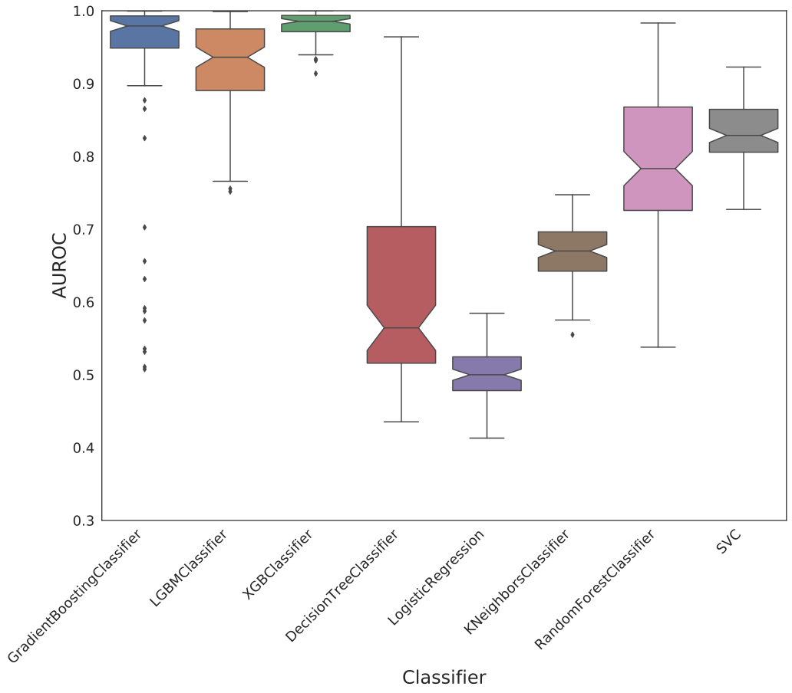
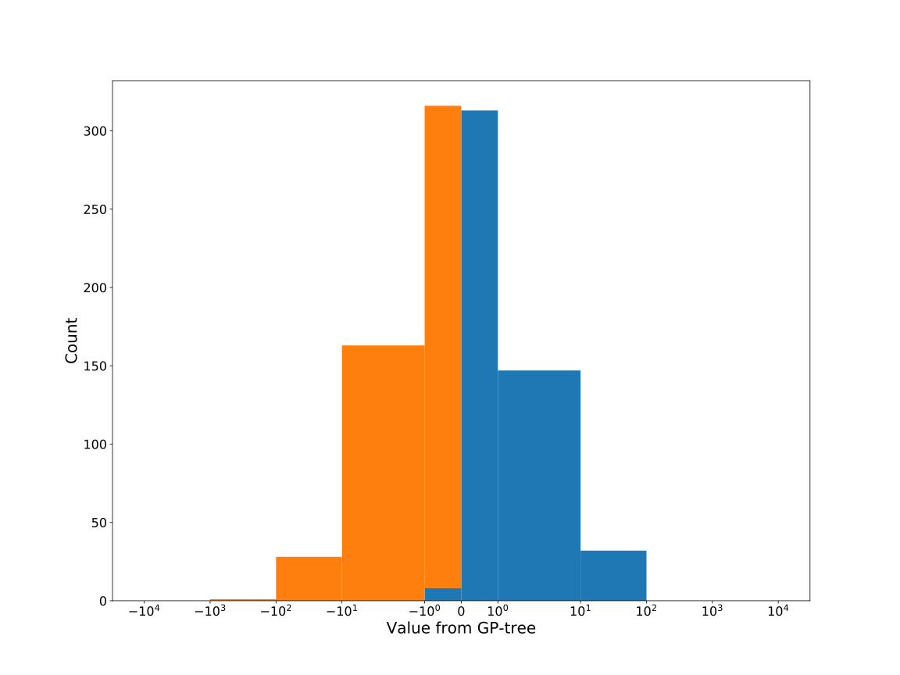

# Dataset: digen7
**Random seed: 6949**<br/>
Order of the methods: LXGSFKDR<br/>
Mean performance: 0.818<br/>
Standard deviation: 0.169<br/>


|    | classifier                 |   auroc |    auprc |   f1_score |   rank_auroc |   rank_auprc |   rank_f1 |
|---:|:---------------------------|--------:|---------:|-----------:|-------------:|-------------:|----------:|
|  0 | GradientBoostingClassifier |  0.9845 | 0.976151 |   0.955665 |            3 |            3 |         2 |
|  1 | LGBMClassifier             |  0.9947 | 0.994595 |   0.965174 |            1 |            1 |         1 |
|  2 | XGBClassifier              |  0.9903 | 0.990342 |   0.95     |            2 |            2 |         3 |
|  3 | DecisionTreeClassifier     |  0.658  | 0.660479 |   0.477419 |            7 |            7 |         8 |
|  4 | LogisticRegression         |  0.5184 | 0.513488 |   0.502463 |            8 |            8 |         7 |
|  5 | KNeighborsClassifier       |  0.6804 | 0.684792 |   0.635071 |            6 |            6 |         6 |
|  6 | RandomForestClassifier     |  0.8355 | 0.832104 |   0.723404 |            5 |            5 |         5 |
|  7 | SVC                        |  0.8832 | 0.888382 |   0.817308 |            4 |            4 |         4 |


<details>
<summary>Parameters of tuned ML methods (based on 200 optimizations started from seed 6949)</summary>


```
GradientBoostingClassifier(learning_rate=0.6021222284440112, max_depth=8,
                           min_samples_leaf=60, n_iter_no_change=14,
                           random_state=6949, tol=1e-07,
                           validation_fraction=0.060000000000000005)
LGBMClassifier(deterministic=True, force_row_wise=True, max_depth=9,
               metric='binary_logloss', n_estimators=96, n_jobs=1,
               num_leaves=512, objective='binary', random_state=6949)
XGBClassifier(alpha=2.391969243553242e-05, base_score=0.5, booster='dart',
              colsample_bylevel=1, colsample_bynode=1, colsample_bytree=1,
              eta=0.3207789937874551, eval_metric='logloss', gamma=0.1,
              gpu_id=-1, importance_type='gain', interaction_constraints='',
              learning_rate=0.320778996, max_delta_step=0, max_depth=8,
              min_child_weight=1, missing=nan, monotone_constraints='()',
              n_estimators=90, n_jobs=1, nthread=1, num_parallel_tree=1,
              random_state=6949, reg_alpha=2.39196925e-05,
              reg_lambda=17.10284823440849, scale_pos_weight=1, subsample=1,
              tree_method='exact', use_label_encoder=False,
              validate_parameters=1, ...)
DecisionTreeClassifier(max_depth=7, min_samples_leaf=2, min_samples_split=11,
                       random_state=6949)
LogisticRegression(C=1.9194788815338437, penalty='l1', random_state=6949,
                   solver='liblinear')
KNeighborsClassifier(n_neighbors=13, p=1, weights='distance')
RandomForestClassifier(max_depth=9, max_features=None, min_samples_leaf=6,
                       min_samples_split=12, n_estimators=81,
                       random_state=6949)
SVC(C=323.43949458487094, class_weight='balanced', kernel='poly',
    probability=True, random_state=6949, tol=0.0008527601588477126)
```

</details>

<details>
<summary>Expected performance (based on 100 runs, each with 100 optimizations started from a different random seed)</summary>

</details>

<details>
<summary>Receiver Operating Characteristics (ROC) curve</summary>

</details>

<details>
<summary>Precision-Recall Curve</summary>

</details>

<details>
<summary>Model (GP-tree)</summary>

</details>

<details>
<summary>Endpoint histogram</summary>

</details>

<details>
<summary>Feature correlations</summary>

</details>

[**Pandas Profiling Report**](https://epistasislab.github.io/digen/profile/digen7_6949.html)