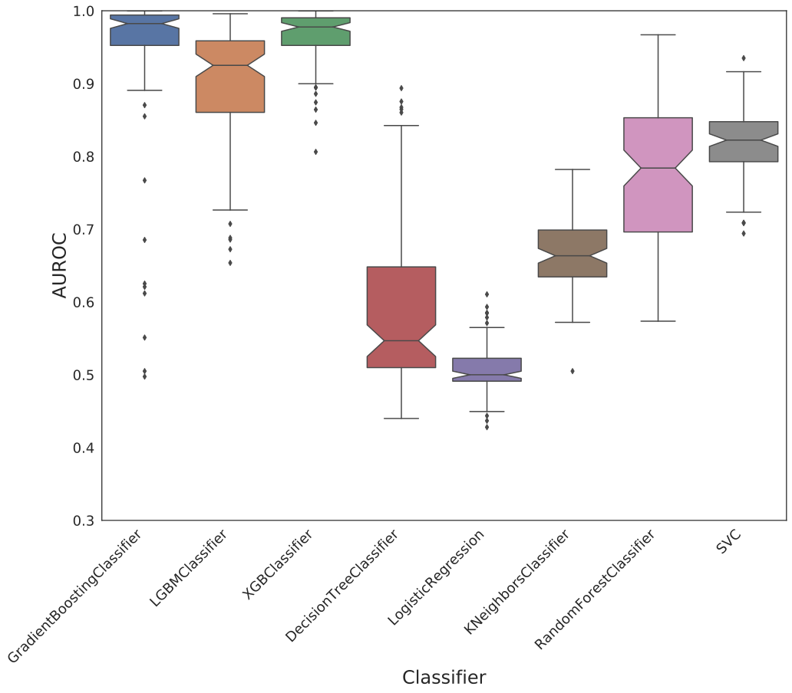
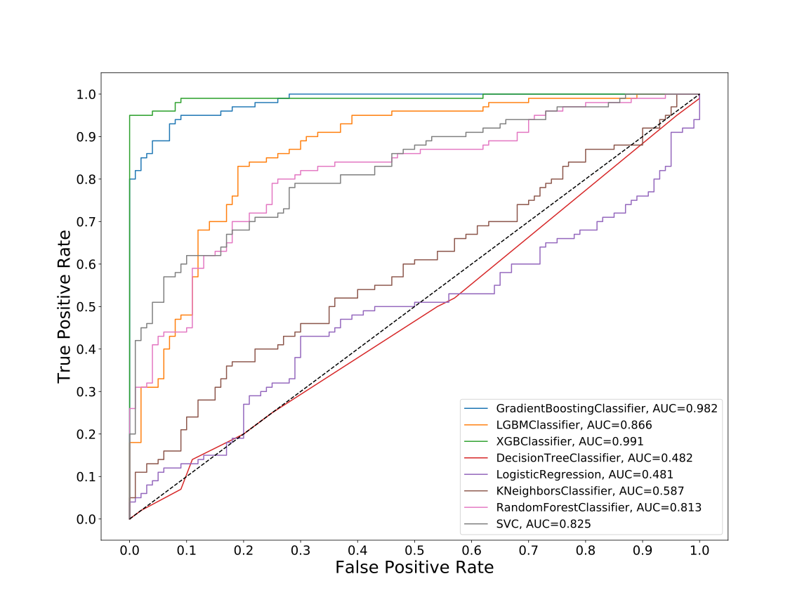
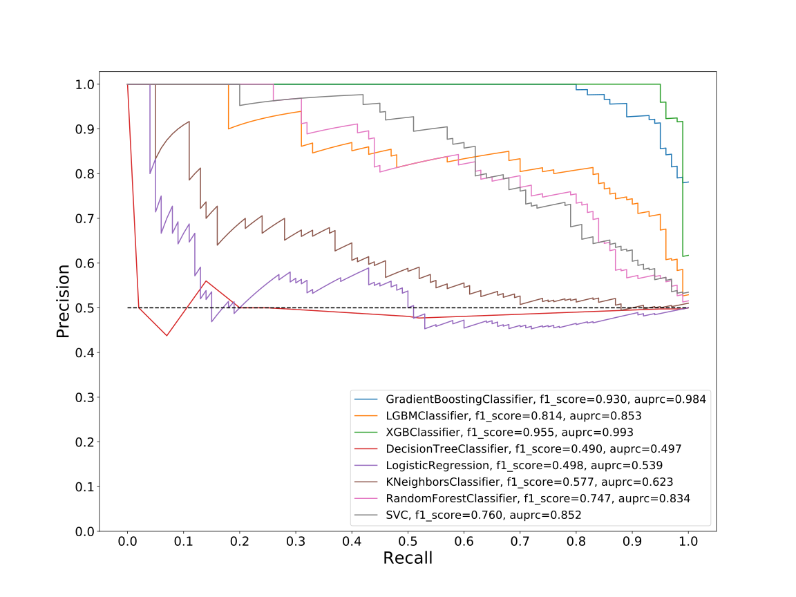
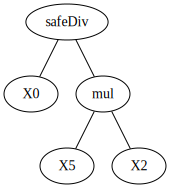
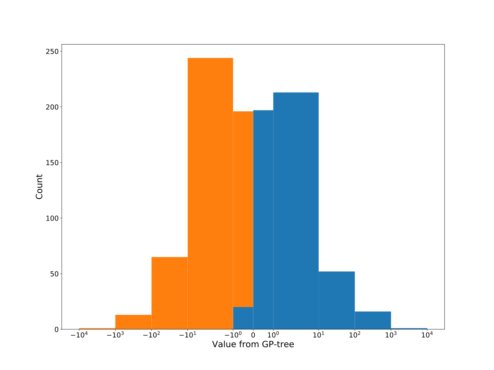
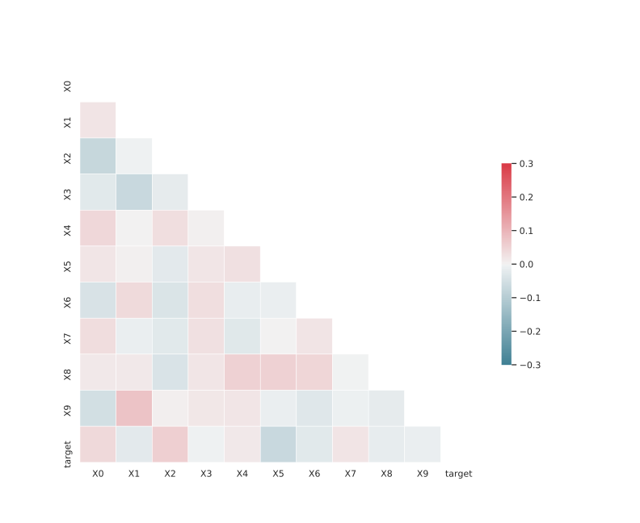

# Dataset: digen8_4426 (XGLSFKDR_0.196_0.753_4426)

|    | classifier                 |   auroc |    auprc |   f1_score |   rank_auroc |   rank_auprc |   rank_f1 |
|---:|:---------------------------|--------:|---------:|-----------:|-------------:|-------------:|----------:|
|  0 | GradientBoostingClassifier |  0.9822 | 0.983756 |   0.93     |            2 |            2 |         2 |
|  1 | LGBMClassifier             |  0.8659 | 0.852749 |   0.813725 |            3 |            3 |         3 |
|  2 | XGBClassifier              |  0.9909 | 0.993398 |   0.954774 |            1 |            1 |         1 |
|  3 | DecisionTreeClassifier     |  0.4815 | 0.496715 |   0.490196 |            7 |            8 |         8 |
|  4 | LogisticRegression         |  0.4806 | 0.538716 |   0.497561 |            8 |            7 |         7 |
|  5 | KNeighborsClassifier       |  0.5871 | 0.623277 |   0.576923 |            6 |            6 |         6 |
|  6 | RandomForestClassifier     |  0.8132 | 0.833576 |   0.747475 |            5 |            5 |         5 |
|  7 | SVC                        |  0.8249 | 0.851723 |   0.759615 |            4 |            4 |         4 |


<details>
<summary>Parameters of tuned ML methods (200 optimizations)</summary>


```
GradientBoostingClassifier(learning_rate=0.6051963388547121, max_depth=10,
                           min_samples_leaf=59, n_iter_no_change=20,
                           random_state=4426, tol=1e-07,
                           validation_fraction=0.02)
LGBMClassifier(deterministic=True, force_row_wise=True, max_depth=10,
               metric='binary_logloss', n_estimators=96, n_jobs=1,
               num_leaves=1024, objective='binary', random_state=4426)
XGBClassifier(alpha=1.2456360378125861, base_score=0.5, booster='gbtree',
              colsample_bylevel=1, colsample_bynode=1, colsample_bytree=1,
              eta=0.16282657537320092, eval_metric='logloss', gamma=0.0,
              gpu_id=-1, importance_type='gain', interaction_constraints='',
              learning_rate=0.162826583, max_delta_step=0, max_depth=7,
              min_child_weight=1, missing=nan, monotone_constraints='()',
              n_estimators=88, n_jobs=1, nthread=1, num_parallel_tree=1,
              random_state=4426, reg_alpha=1.24563599,
              reg_lambda=12.442461714276437, scale_pos_weight=1, subsample=1,
              tree_method='exact', use_label_encoder=False,
              validate_parameters=1, ...)
DecisionTreeClassifier(criterion='entropy', max_depth=4, max_features='auto',
                       min_samples_leaf=18, min_samples_split=8,
                       random_state=4426)
LogisticRegression(C=0.00010119217763329698, random_state=4426, solver='sag')
KNeighborsClassifier(metric='euclidean', n_neighbors=8, weights='distance')
RandomForestClassifier(max_depth=10, max_features=None, min_samples_leaf=3,
                       min_samples_split=7, n_estimators=52, random_state=4426)
SVC(C=107.60551985222125, class_weight='balanced', gamma='auto', kernel='poly',
    probability=True, random_state=4426, tol=1.2919784474053641e-05)
```

</details>

<details>
<summary>Expected performance (100 optimizations starting from different random seed)</summary>

</details>

<details>
<summary>Receiver Operating Characteristics (ROC) curve</summary>

</details>

<details>
<summary>Precision-Recall Curve</summary>

</details>

<details>
<summary>Model (GP-tree)</summary>

</details>

<details>
<summary>Endpoint histogram</summary>

</details>

<details>
<summary>Feature correlations</summary>

</details>

[**Pandas Profiling Report**](https://epistasislab.github.io/digen/profile/digen8_4426.html)