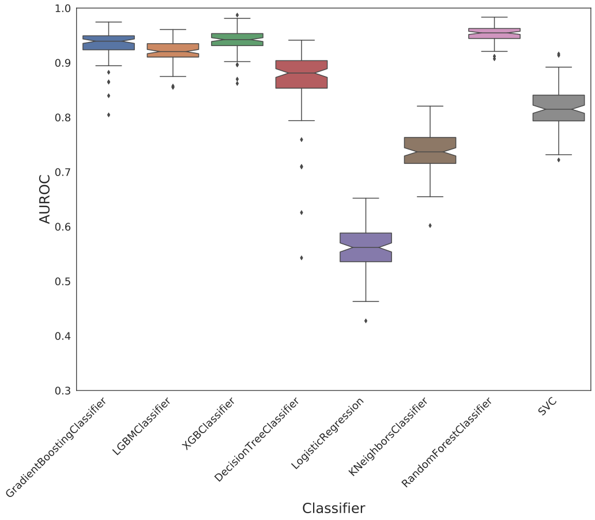
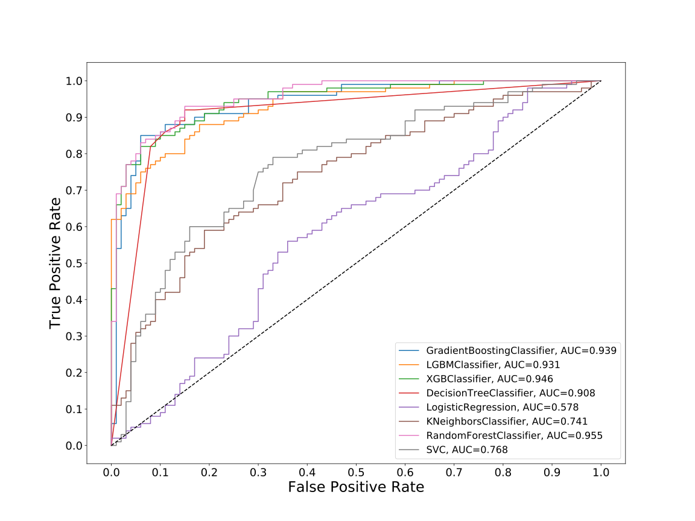
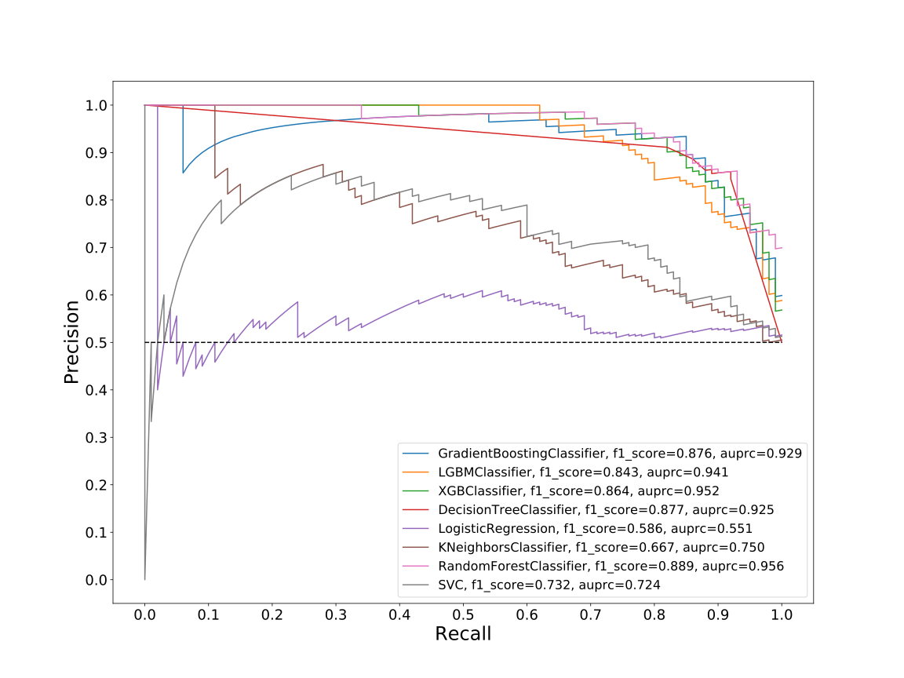
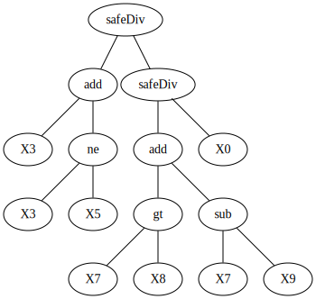
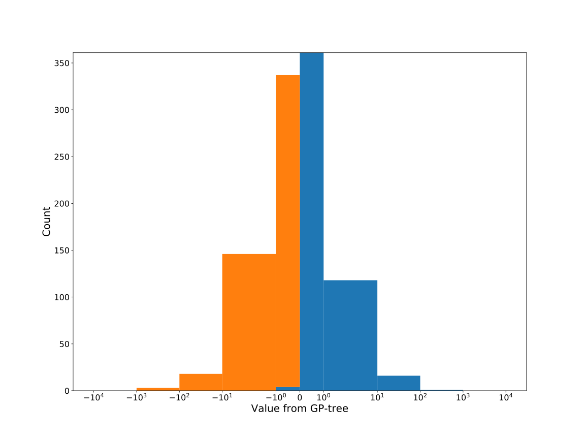
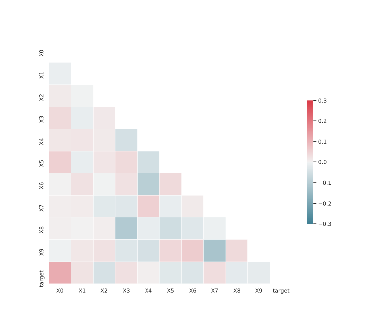

# Dataset: digen9_7270(FGXLDSKR_0.129_0.847_7270)

|    | classifier                 |   auroc |    auprc |   f1_score |   rank_auroc |   rank_auprc |   rank_f1 |
|---:|:---------------------------|--------:|---------:|-----------:|-------------:|-------------:|----------:|
|  0 | GradientBoostingClassifier | 0.9471  | 0.950705 |   0.881188 |            2 |            3 |         2 |
|  1 | LGBMClassifier             | 0.931   | 0.941125 |   0.843137 |            4 |            4 |         5 |
|  2 | XGBClassifier              | 0.9459  | 0.95207  |   0.864078 |            3 |            2 |         4 |
|  3 | DecisionTreeClassifier     | 0.9082  | 0.925133 |   0.876847 |            5 |            5 |         3 |
|  4 | LogisticRegression         | 0.5782  | 0.550618 |   0.585859 |            8 |            8 |         8 |
|  5 | KNeighborsClassifier       | 0.7407  | 0.749744 |   0.666667 |            7 |            6 |         7 |
|  6 | RandomForestClassifier     | 0.9553  | 0.956345 |   0.888889 |            1 |            1 |         1 |
|  7 | SVC                        | 0.76785 | 0.724086 |   0.731707 |            6 |            7 |         6 |


<details>
<summary>Parameters of tuned ML methods</summary>


```
GradientBoostingClassifier(learning_rate=0.16375287436614608,
                           loss='exponential', max_depth=8, min_samples_leaf=4,
                           n_iter_no_change=2, random_state=7270, tol=1e-07,
                           validation_fraction=0.03)
LGBMClassifier(boosting_type='dart', deterministic=True, force_row_wise=True,
               max_depth=7, metric='binary_logloss', n_estimators=56, n_jobs=1,
               num_leaves=128, objective='binary', random_state=7270)
XGBClassifier(alpha=0.9576029421451795, base_score=0.5, booster='gbtree',
              colsample_bylevel=1, colsample_bynode=1, colsample_bytree=1,
              eta=0.044087748876496156, eval_metric='logloss',
              gamma=0.30000000000000004, gpu_id=-1, importance_type='gain',
              interaction_constraints='', learning_rate=0.044087749,
              max_delta_step=0, max_depth=9, min_child_weight=1, missing=nan,
              monotone_constraints='()', n_estimators=44, n_jobs=1, nthread=1,
              num_parallel_tree=1, random_state=7270, reg_alpha=0.957602918,
              reg_lambda=0.00036394185205991997, scale_pos_weight=1,
              subsample=1, tree_method='exact', use_label_encoder=False,
              validate_parameters=1, ...)
DecisionTreeClassifier(criterion='entropy', max_depth=9, min_samples_leaf=2,
                       min_samples_split=7, random_state=7270)
LogisticRegression(C=0.045461530662846666, penalty='l1', random_state=7270,
                   solver='liblinear')
KNeighborsClassifier(n_neighbors=18, p=1, weights='distance')
RandomForestClassifier(criterion='entropy', max_depth=8, max_features=None,
                       min_samples_leaf=2, min_samples_split=6, n_estimators=64,
                       random_state=7270)
SVC(C=1.5102802071652903, coef0=1.0, degree=4, gamma='auto', kernel='poly',
    probability=True, random_state=7270, tol=0.0001789362220885197)
```

</details>

<details>
<summary>Expected performance (200 experiments per ML method)</summary>

</details>

<details>
<summary>Receiver Operating Characteristics (ROC) curve</summary>

</details>

<details>
<summary>Precision-Recall Curve</summary>

</details>

<details>
<summary>Model (GP-tree)</summary>

</details>

<details>
<summary>Endpoint histogram</summary>

</details>

<details>
<summary>Feature correlations</summary>

</details>

[**Pandas Profiling Report**](https://github.io/athril/digen-test/docs/profile/digen9_7270.html)